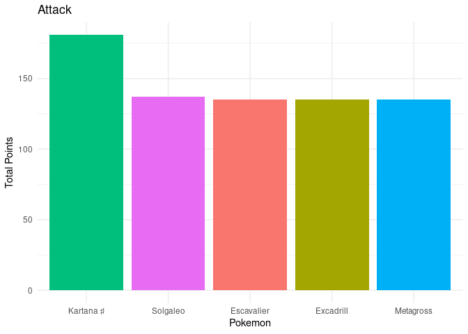

Competitive Pokemon Analysis
================
Ricky Warner
12/1/2020

``` r
library(tidyverse)
library(knitr)
```

``` r
PokeData.v1 <- read_csv('./PokemonMasterList.csv')

PokeData.v2 <- PokeData.v1 %>%
  mutate(Total = Attack + Defense + SpecialAttack + SpecialDefense + Speed) %>%
  filter(Abilities != "NA")
```

## Background

As many of my friends and family can testify, I am a very big fan of
pokemon. I have been playing since I was very little when I got my first
pokemon game: Pokemon Colosseum. Despite my many years of playing
pokemon, I have a confession to make: I am not a very good competitive
player. My teams have always been mainly favorites I’ve found while
travelling in the games. While it’s usually enough to get through the
game, it’s not enough to face people head on competitively. After awhile
I had the realization. I have a background in data science, why not use
that to help me design a perfect team? And so, after a bit of work, the
following analysis was born.

The list of pokemon used in this analysis was pulled from Wikipedia’s
list of [Pokemon](https://en.wikipedia.org/wiki/List_of_Pok%C3%A9mon).
The additional info (moves, stats, weight) was gathered from the
[PokeApi](https://pokeapi.co/) If you are interested in viewing the code
that I used to compile the dataset, please check
[here](https://github.com/rickytwarner/PokemonAnalysis/blob/master/PokemonAnalysis.R).

Note: While my code is set up to grab data on all pokemon from
generations 1-8. As of 12.1.2020, a lot of Gen 8 data is missing from
the API. The PokeApi team is planning to update the API to include the
missing data and whent they do I will recreate my analysis. Note: I am
only including regular form pokemon in this analysis. Pokemon can take
different forms (such as Mega Evolutions and alternate forms).

``` r
Type1 <- PokeData.v2 %>%
  select(Pokemon, Type1, Total)

Type2 <- PokeData.v2 %>%
  select(Pokemon, Type2, Total) %>%
  rename(Type1 = Type2)

ByType.v1<- rbind(Type1, Type2)

ByType.v2 <- ByType.v1 %>%
  filter(Type1 != "None") %>%
  rename(Type = Type1)

TypeCount <- ByType.v2 %>%
  group_by(Type) %>%
  summarize(Count = n())


TypeAverage <- ByType.v2 %>%
  group_by(Type) %>%
  summarize(Average = mean(Total))
```

## Pokemon Types

All pokemon have types. Each type has strengths and weaknesses. One of
the most common examples of type matchups is fire, water and grass.
Grass is strong against water, but it is weak against fire. Fire is
strong against grass but is weak against water. Water is strong against
fire but weak against grass. A pokemon can have more than one type which
can allow for an additional level of complexity. Some attacks that would
normally be strong against a certain type might be neutralized, that or
it could be twice as strong. For the purpose of this analysis, I decided
I wanted to focus my team around a specific type. The reason for this is
a lot of people have multiple different types on their team to try to
cover a wide range of weaknesses. If I was to also use a multiple type
team, I run the risk of always having a pokemon on the opponents team
that could floor each member of my team. With a focus on one specific
type, I would only have to worry about possibly one or two pokemon on
the opponents team, but the others would be easier to take on. Below
shows the amount of pokemon that are associated with a specific type.

``` r
TypeCount %>%
  ggplot(aes(reorder(Type, -Count), Count)) + 
  geom_bar(stat="identity", fill = "Purple") + 
  scale_x_discrete(guide = guide_axis(n.dodge=3)) +
  theme_minimal()
```


## Pokemon Stats

All pokemon have points in 5 categories: Attack, Defense, Special
Attack, Special Defense, and Speed. The best pokemon to have on your
team will usually have very high points in one more more categories.
Since we wanted to build our team around a single type. We’ll want to
compare which Type usually has the highest average points.

From the graph below, we can conclude that Metal has the highest points
on average. However Dragon comes in a close second.

``` r
TypeAverage %>%
  ggplot(aes(reorder(Type, -Average), Average)) + 
  geom_bar(stat="identity", fill = "DarkGreen") + 
  scale_x_discrete(guide = guide_axis(n.dodge=3)) +
  theme_minimal() 
```


## Picking our team

Now that we have found our type, it’s now time to build our team. We’ll
want to build our team around getting the best of each different
category: Attack, Defense, Special Attack, Special Defense, and Speed.

``` r
Steel.v1 <- PokeData.v2 %>%
  filter(Type1 == "steel" | Type2 == "steel")
```

``` r
Steel.v1 %>%
  arrange(-Attack) %>%
  head(5) %>%
  ggplot(aes(reorder(Pokemon, -Attack), Attack, fill = Pokemon)) +
           geom_bar(stat = "identity") + 
  labs(
    x = "Pokemon",
    y = "Total Points",
    title = "Attack"
  ) +
theme_minimal() + 
    theme(legend.position="none")
```


<br> Kartana takes the lead for Attack amongst the Metal Types at 181.
It also has high defense as well at 131. However with it’s typing of
Metal and Grass, this makes it 4x weak against fire types. With slow
speed as well this would mean that it could easily be knocked out in one
hit. The solution to this would be only sending out Kartana once you’ve
ensured that any fire type pokemon have been eliminated from the
opponents team.

``` r
Steel.v1 %>%
  arrange(-Defense) %>%
  head(5) %>%
  ggplot(aes(reorder(Pokemon, -Defense), Defense, fill = Pokemon)) +
           geom_bar(stat = "identity") + 
  labs(
    x = "Pokemon",
    y = "Total Points",
    title = "Defense"
  ) + 
  theme_minimal() + 
  theme(legend.position="none")
```


<br> Stakataka has the highest defense of all Metal Type pokemon at 211
making this pokemon a tank. However due to it’s typing of Steel and
Rock, it is 4x as weak to fighting. However due to it’s super high
defense, and it’s ability to learn Psychic moves such as Zen Headbutt
and high attack, it could potentially hold very well against fighting
type pokemon.

``` r
Steel.v1 %>%
  arrange(-SpecialAttack) %>%
  head(5) %>%
  ggplot(aes(reorder(Pokemon, -SpecialAttack), SpecialAttack, fill = Pokemon)) +
           geom_bar(stat = "identity") + 
  labs(
    x = "Pokemon",
    y = "Total Points",
    title = "Special Attack"
  ) +
  theme_minimal() +
  theme(legend.position="none")
```


<br> In terms of highest Special Attack, Dialga is uncontested amongst
the metal pokemon at 150. Also thanks to it’s Steel Dragon Typing, it is
only 2x weak against fighting. Also thanks to it’s Ability Pressure, it
means that all opponent moves will take twice the amount of energy so
there is a higher risk in using high damage/few use moves.

``` r
Steel.v1 %>%
  arrange(-SpecialDefense) %>%
  head(5) %>%
  ggplot(aes(reorder(Pokemon, -SpecialDefense), SpecialDefense, fill = Pokemon)) +
           geom_bar(stat = "identity") + 
  labs(
    x = "Pokemon",
    y = "Total Points",
    title = "Special Defense"
  ) +
  theme_minimal() +
  theme(legend.position="none")
```


<br> With Special Defense, we actually have 3 winners: Aegislash,
Probopass, and Registeel. Since I have the choice since it’s a 3 way
tie, I’ll have to go with Aegislash. Aegislashes ability allows it to
switch it’s special attack and special defense. Which means it could be
a heavy hitter or a tank depending on how you want to play with it.
Since you can change those stats in the middle of the battle, you can
change your battling style depending on how the opponent is attacking.

``` r
Steel.v1 %>%
  arrange(-Speed) %>%
  head(5) %>%
  ggplot(aes(reorder(Pokemon, -Speed), Speed, fill = Pokemon)) +
           geom_bar(stat = "identity") + 
  labs(
    x = "Pokemon",
    y = "Total Points",
    title = "Speed"
  ) +
  theme_minimal() +
  theme(legend.position="none")
```


<br> Solgaelo takes the lead with Speed at 137. Also due to it’s high
attack and HP, we’ll probably want to lead with this pokemon. It should
be able to do some immediate damage and possibly even 1 hit KO some of
the slower pokemon.

# Personal Choice

My final steel type choice will be Metagross. Besides being a personal
favorite pokemon, Metagross has great overall stats. On top of that,
Metagross has the potential to learn some surprising moves such as Ice
and Thunder punch, as well as SandStorm which would affect any of my
team and psychic which is a very powerful psychic type move.

``` r
FinalTeam <- Steel.v1 %>%
  select(-Moves, -Generation, -ID) %>%
  select(Pokemon, Type1, Type2, Height, HP, Attack, Defense, SpecialAttack, SpecialDefense, Speed, Total) %>%
  filter(Pokemon == "Kartana ♯" | Pokemon == "Stakataka ♯" | Pokemon == "Dialga" | Pokemon == "Aegislash" | Pokemon == "Solgaleo" | Pokemon == "Metagross")

kable(FinalTeam, caption = "Final Team")
```

<table>

<caption>

Final Team

</caption>

<thead>

<tr>

<th style="text-align:left;">

Pokemon

</th>

<th style="text-align:left;">

Type1

</th>

<th style="text-align:left;">

Type2

</th>

<th style="text-align:right;">

Height

</th>

<th style="text-align:right;">

HP

</th>

<th style="text-align:right;">

Attack

</th>

<th style="text-align:right;">

Defense

</th>

<th style="text-align:right;">

SpecialAttack

</th>

<th style="text-align:right;">

SpecialDefense

</th>

<th style="text-align:right;">

Speed

</th>

<th style="text-align:right;">

Total

</th>

</tr>

</thead>

<tbody>

<tr>

<td style="text-align:left;">

Dialga

</td>

<td style="text-align:left;">

steel

</td>

<td style="text-align:left;">

dragon

</td>

<td style="text-align:right;">

54

</td>

<td style="text-align:right;">

100

</td>

<td style="text-align:right;">

120

</td>

<td style="text-align:right;">

120

</td>

<td style="text-align:right;">

150

</td>

<td style="text-align:right;">

100

</td>

<td style="text-align:right;">

100

</td>

<td style="text-align:right;">

590

</td>

</tr>

<tr>

<td style="text-align:left;">

Metagross

</td>

<td style="text-align:left;">

steel

</td>

<td style="text-align:left;">

psychic

</td>

<td style="text-align:right;">

16

</td>

<td style="text-align:right;">

80

</td>

<td style="text-align:right;">

135

</td>

<td style="text-align:right;">

130

</td>

<td style="text-align:right;">

95

</td>

<td style="text-align:right;">

90

</td>

<td style="text-align:right;">

80

</td>

<td style="text-align:right;">

530

</td>

</tr>

<tr>

<td style="text-align:left;">

Aegislash

</td>

<td style="text-align:left;">

steel

</td>

<td style="text-align:left;">

ghost

</td>

<td style="text-align:right;">

17

</td>

<td style="text-align:right;">

60

</td>

<td style="text-align:right;">

50

</td>

<td style="text-align:right;">

150

</td>

<td style="text-align:right;">

50

</td>

<td style="text-align:right;">

150

</td>

<td style="text-align:right;">

60

</td>

<td style="text-align:right;">

460

</td>

</tr>

<tr>

<td style="text-align:left;">

Solgaleo

</td>

<td style="text-align:left;">

psychic

</td>

<td style="text-align:left;">

steel

</td>

<td style="text-align:right;">

34

</td>

<td style="text-align:right;">

137

</td>

<td style="text-align:right;">

137

</td>

<td style="text-align:right;">

107

</td>

<td style="text-align:right;">

113

</td>

<td style="text-align:right;">

89

</td>

<td style="text-align:right;">

137

</td>

<td style="text-align:right;">

583

</td>

</tr>

<tr>

<td style="text-align:left;">

Kartana ♯

</td>

<td style="text-align:left;">

grass

</td>

<td style="text-align:left;">

steel

</td>

<td style="text-align:right;">

3

</td>

<td style="text-align:right;">

59

</td>

<td style="text-align:right;">

181

</td>

<td style="text-align:right;">

131

</td>

<td style="text-align:right;">

59

</td>

<td style="text-align:right;">

31

</td>

<td style="text-align:right;">

59

</td>

<td style="text-align:right;">

461

</td>

</tr>

<tr>

<td style="text-align:left;">

Stakataka ♯

</td>

<td style="text-align:left;">

rock

</td>

<td style="text-align:left;">

steel

</td>

<td style="text-align:right;">

55

</td>

<td style="text-align:right;">

61

</td>

<td style="text-align:right;">

131

</td>

<td style="text-align:right;">

211

</td>

<td style="text-align:right;">

53

</td>

<td style="text-align:right;">

101

</td>

<td style="text-align:right;">

61

</td>

<td style="text-align:right;">

557

</td>

</tr>

</tbody>

</table>
